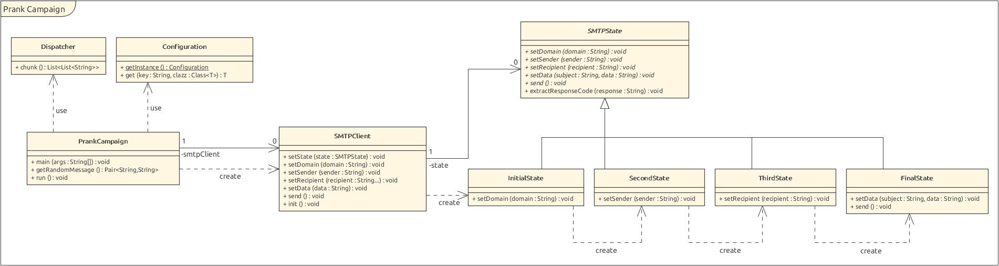

# Prank Campaign generator 1.0
## Description
This project allows you to generate a prank campaign in a fully automatic way.

## Setting up the SMTP Server
You can use a mock smtp server to test this software. A mock service fake the behaviour of the real service.

For this project, a docker image is provided. You have to build it first
```docker build -t mock-smtp .```

and the start the container. The image expose two ports. 25 for smtp protocol and 8282 for the webaccess.
```docker run --rm -p 2525:25 -p 8282:8282 mock-smtp```
## Running a compaign
1. Clone the repo
2. run ```gradlew jar```. This will generate an app folder with all you need to start a campaign
3. rename and modify the __sample_config.yml__ to __config.yml__.
4. Run the app ```java -jar prank-campaign-1.0-SNAPSHOT.jar```

## Implementation
The smtp client implements the state pattern. This ensures that the client (as user) correctly use the API.

